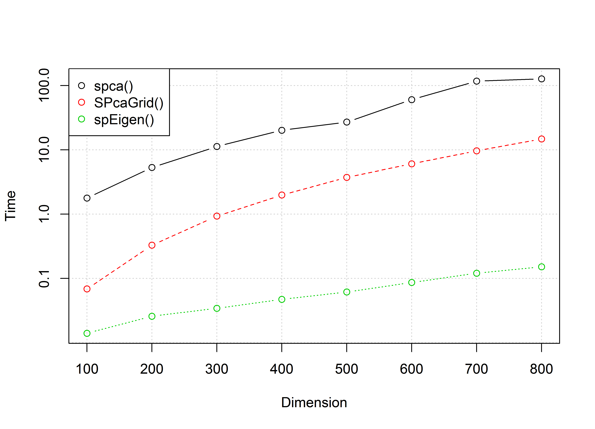
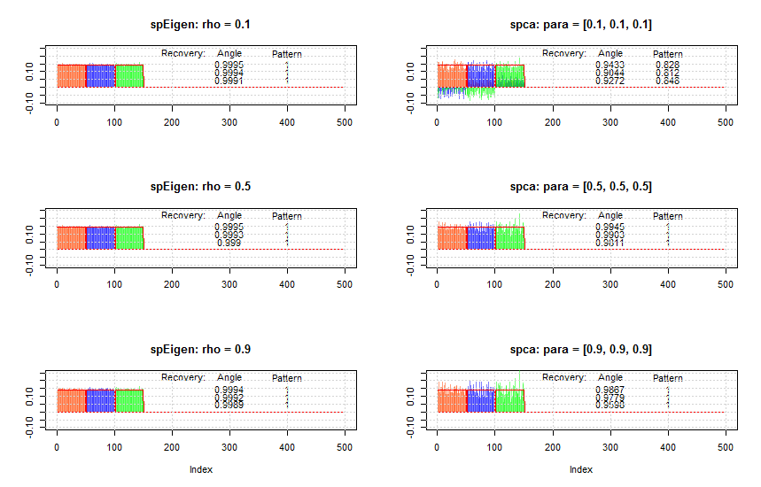

```{r, echo = FALSE}
knitr::opts_chunk$set(
  collapse = TRUE,
  comment = "#>",
  fig.align = "center"
)
#rmarkdown::render("vignettes/sparse_eigenvectors.Rmd", "all")
```

-----------
This vignette illustrates the computation of sparse eigenvectors or sparse PCA with the package `sparseEigen` (with a comparison with other packages) and gives a description of the algorithms used.


# Comparison with other packages
We compare the proposed function `spEigen()` with the functions `elasticnet::spca()` and `rrcovHD::SPcaGrid()`. 

First, we illustrate how the functions scale with dimension. For this, we generate synthetic data with sparse eigenvectors (see next section for details) of increasing dimension (100 Monte Carlo runs in each dimension). We apply the two functions to extract the first three eigenvectors. The figure below illustrates how the running time of the functions increase as we increase the dimension of the problem. It is clear that `spEigen()` scales very well, while `SPcaGrid()` and `spca()` become impractical for large dimensions.

{width=70%}

Another advantage of `spEigen()` (and `spEigenCov()`) is the parsimony and robustness in parameter selection. To illustrate this, in the next figure we compare the angle and pattern recovery ability of yhe functions. To this end, we generate 200 samples form a multivariate Gaussian distribution of dimension 500, following the process described in the next section. 

{width=100%}

We observe that `spEigen()` requires only one parameter and can recover correctly the eigenvectors for a large range of the parameter's values. On the other hand, `spca()` requires one parameter per eigenvector, the recovery is significantly affected by small changes of these parameters, and in general it underperforms compared to `spEigen()`. Finally, `SPcaGrid()` requires one sparsity parameter (it also accepts one parameter per eigenvector) but cannot capture efficiently the sparsity pattern of the eigenvectors.

Further advantages of `spEigen()` are that it can handle real and complex data, and it accepts as input both data and covariance matrices. 


# Usage of the package

## Computation of sparse eigenvectors of a given matrix
We start by loading the package and generating synthetic data with sparse eigenvectors:
```{r}
library(sparseEigen)
set.seed(42)

# parameters 
m <- 500  # dimension
n <- 100  # number of samples
q <- 3  # number of sparse eigenvectors to be estimated
sp_card <- 0.2*m  # cardinality of each sparse eigenvector
rho <- 0.6  # sparsity level

# generate non-overlapping sparse eigenvectors
V <- matrix(0, m, q)
V[cbind(seq(1, q*sp_card), rep(1:q, each = sp_card))] <- 1/sqrt(sp_card)
V <- cbind(V, matrix(rnorm(m*(m-q)), m, m-q))
# keep first q eigenvectors the same (already orthogonal) and orthogonalize the rest
V <- qr.Q(qr(V))

# generate eigenvalues
lmd <- c(100*seq(from = q, to = 1), rep(1, m-q))

# generate covariance matrix from sparse eigenvectors and eigenvalues
R <- V %*% diag(lmd) %*% t(V)

# generate data matrix from a zero-mean multivariate Gaussian distribution 
# with the constructed covariance
X <- MASS::mvrnorm(n, rep(0, m), R)  # random data with underlying sparse structure
```

Then, we estimate the covariance matrix with `cov(X)` and compute its sparse eigenvectors with `spEigen()`:
```{r}
# computation of sparse eigenvectors
res_standard <- eigen(cov(X))
res_sparse1 <- spEigen(cov(X), q, rho)
res_sparse2 <- spEigen(X, q, rho, data = TRUE)
```

We can assess how good the estimated eigenvectors are by computing the inner product with the original eigenvectors (the closer to 1 the better):
```{r}
# show inner product between estimated eigenvectors and originals
abs(diag(t(res_standard$vectors) %*% V[, 1:q]))   #for standard estimated eigenvectors
abs(diag(t(res_sparse1$vectors) %*% V[, 1:q]))    #for sparse estimated eigenvectors
abs(diag(t(res_sparse2$vectors) %*% V[, 1:q]))    #for sparse estimated eigenvectors
```


Finally, the following plot shows the sparsity pattern of the eigenvectors (sparse computation vs. classical computation):
```{r, fig.height = 7, fig.width = 7}
par(mfcol = c(3, 2))
plot(res_sparse1$vectors[, 1]*sign(res_sparse1$vectors[1, 1]), 
     main = "First sparse eigenvector", xlab = "index", ylab = "", type = "h")
lines(V[, 1]*sign(V[1, 1]), col = "red")
plot(res_sparse1$vectors[, 2]*sign(res_sparse1$vectors[sp_card+1, 2]), 
     main = "Second sparse eigenvector", xlab = "index", ylab = "", type = "h")
lines(V[, 2]*sign(V[sp_card+1, 2]), col = "red")
plot(res_sparse1$vectors[, 3]*sign(res_sparse1$vectors[2*sp_card+1, 3]), 
     main = "Third sparse eigenvector", xlab = "index", ylab = "", type = "h")
lines(V[, 3]*sign(V[2*sp_card+1, 3]), col = "red")

plot(res_standard$vectors[, 1]*sign(res_standard$vectors[1, 1]), 
     main = "First regular eigenvector", xlab = "index", ylab = "", type = "h")
lines(V[, 1]*sign(V[1, 1]), col = "red")
plot(res_standard$vectors[, 2]*sign(res_standard$vectors[sp_card+1, 2]), 
     main = "Second regular eigenvector", xlab = "index", ylab = "", type = "h")
lines(V[, 2]*sign(V[sp_card+1, 2]), col = "red")
plot(res_standard$vectors[, 3]*sign(res_standard$vectors[2*sp_card+1, 3]), 
     main = "Third regular eigenvector", xlab = "index", ylab = "", type = "h")
lines(V[, 3]*sign(V[2*sp_card+1, 3]), col = "red")
```

## Covariance matrix estimation with sparse eigenvectors
The function `spEigenCov()` requires more samples than the dimension (otherwise some regularization is required). Therefore, we generate data as previously with the only difference that we set the number of samples to be `n=600`.

```{r, echo = FALSE}
n <- 600  # number of samples
X <- MASS::mvrnorm(n, rep(0, m), R)  # random data with underlying sparse structure
```

Then, we compute the covariance matrix through the joint estimation of sparse eigenvectors and eigenvalues:
```{r}
# computation of covariance matrix
res_sparse3 <- spEigenCov(cov(X), q, rho)
```

Again, we can assess how good the estimated eigenvectors are by computing the inner product with the original eigenvectors:
```{r}
# show inner product between estimated eigenvectors and originals
abs(diag(t(res_sparse3$vectors[, 1:q]) %*% V[, 1:q]))    #for sparse estimated eigenvectors
```

The following plot shows the sparsity pattern of the eigenvectors:
```{r, fig.height = 6, fig.width = 5}
par(mfcol = c(3, 1))
plot(res_sparse3$vectors[, 1]*sign(res_sparse3$vectors[1, 1]), 
     main = "First sparse eigenvector", xlab = "index", ylab = "", type = "h")
lines(V[, 1]*sign(V[1, 1]), col = "red")
plot(res_sparse3$vectors[, 2]*sign(res_sparse3$vectors[sp_card+1, 2]), 
     main = "Second sparse eigenvector", xlab = "index", ylab = "", type = "h")
lines(V[, 2]*sign(V[sp_card+1, 2]), col = "red")
plot(res_sparse3$vectors[, 3]*sign(res_sparse3$vectors[2*sp_card+1, 3]), 
     main = "Third sparse eigenvector", xlab = "index", ylab = "", type = "h")
lines(V[, 3]*sign(V[2*sp_card+1, 3]), col = "red")
```

Finally, we can compute the error of the estimated covariance matrix (sparse eigenvector computation vs. classical computation):
```{r}
# show error between estimated and true covariance 
norm(cov(X) - R, type = 'F') #for sample covariance matrix
norm(res_sparse3$cov - R, type = 'F') #for covariance with sparse eigenvectors
```

## Complex-valued inputs

The previous examples illustrate the usage of the functions `spEigen()` and `spEigenCov()` for real-valued data and covariance matrices. However, both functions can handle complex-valued inputs. 

Following the previous data generation procedure, we generate sparse complex eigenvectors by introducing a random phase in each entry:
```{r}
m <- 500 # dimension
n <- 600 # number of samples
q <- 3 # number of sparse eigenvectors to be estimated
sp_card <- 0.2*m # cardinality of the sparse eigenvectors
rho <- 0.5

# generate non-overlapping sparse eigenvectors
V <- matrix(0, m, q)
V[cbind(seq(1, q*sp_card), rep(1:q, each = sp_card))] <- 
  exp(1i*runif(q*sp_card, 0, 2*pi))/sqrt(sp_card)
V <- cbind(V, matrix(rnorm(m*(m-q))*exp(1i*runif(m*(m-q),0,2*pi)), m, m-q))
# keep first q eigenvectors the same (already orthogonal) and orthogonalize the rest
V_ <- (diag(m) - V[, 1:q] %*% Conj(t(V[, 1:q]))) %*% V[, -c(1:q)]
V <- cbind(V[, 1:q], qr.Q(qr(V_)))

# generate eigenvalues
lmd <- c(100*seq(from = q, to = 1), rep(1, m-q))

# generate covariance matrix from sparse eigenvectors and eigenvalues
R <- V %*% diag(lmd) %*% Conj(t(V))

# generate data matrix from a zero-mean multivariate Gaussian distribution 
# with the constructed covariance
X <- MASS::mvrnorm(n, rep(0, m), R)  # random data with underlying sparse structure
X <- scale(X, center = TRUE, scale = FALSE)
```

Then, we compute the sparse complex eigenvectors (`spEigen()`) and the covariance matrix (`spEigenCov()`):
```{r}
# computation of sparse eigenvectors and covariance matrix
S <- 1/(n-1) * t(X) %*% Conj(X)
res_sparse4 <- spEigen(S, q, rho)
res_sparse5 <- spEigenCov(S, q, rho)
```

The following plot shows the sparsity pattern of the eigenvectors for both functions:
```{r, fig.height = 7, fig.width = 7}
par(mfcol = c(3, 2))
plot(abs(res_sparse4$vectors[, 1]), main = "spEigen: First sparse eigenvector", 
     xlab = "index", ylab = "", type = "h")
lines(abs(V[, 1]), col = "red")
plot(abs(res_sparse4$vectors[, 2]), main = "spEigen: Second sparse eigenvector", 
     xlab = "index", ylab = "", type = "h")
lines(abs(V[, 2]), col = "red")
plot(abs(res_sparse4$vectors[, 3]), main = "spEigen: Third sparse eigenvector", 
     xlab = "index", ylab = "", type = "h")
lines(abs(V[, 3]), col = "red")

plot(abs(res_sparse5$vectors[, 1]), main = "spEigenCov: First sparse eigenvector", 
     xlab = "index", ylab = "", type = "h")
lines(abs(V[, 1]), col = "red")
plot(abs(res_sparse5$vectors[, 2]), main = "spEigenCov: Second sparse eigenvector", 
     xlab = "index", ylab = "", type = "h")
lines(abs(V[, 2]), col = "red")
plot(abs(res_sparse5$vectors[, 3]), main = "spEigenCov: Third sparse eigenvector", 
     xlab = "index", ylab = "", type = "h")
lines(abs(V[, 3]), col = "red")
```

Finally, we can compute the error of the estimated covariance matrix (sparse eigenvector computation vs. classical computation):
```{r}
# show error between estimated and true covariance 
norm(abs(S - R), type = 'F') #for sample covariance matrix
norm(abs(res_sparse5$cov - R), type = 'F') #for covariance with sparse eigenvectors
```

# Explanation of the algorithms

## `spEigen()`: Sparse eigenvectors from a given covariance matrix

The goal of `spEigen()` is the estimation of the $q$ leading sparse eigenvectors (with $q \leq \text{rank}(\mathbf{S})$) from an $m\times m$ covariance matrix $\mathbf{S}$ (typically the sample covariance matrix obtained from $n$ samples) based on [@BenSunBabuPal2017]. The underlying optimization problem that is solved is
$$\begin{aligned}
	  &\underset{\mathbf{U}}{\text{maximize}}\quad \text{Tr} \left(\mathbf{U}^\top \mathbf{S} \mathbf{U} \text{Diag}   (\mathbf{d})\right) - \sum_{i=1}^{q}\rho_i\|\mathbf{u}_i\|_0\\
  	&\text{subject to}\quad \mathbf{U}^\top\mathbf{U}=\mathbf{I}_q,
  \end{aligned}$$ 
where $\mathbf{U}\in\mathbb{R}^{m\times q}$ is a matrix containing the $q$ leading eigenvectors, $\mathbf{d}$ is a vector of weights to ensure that $\mathbf{U}$ contains the leading eigenvectors without an arbitrary rotation, and the $\rho_i$'s are the regularization parameters to control how much sparsity is desired. This problem is the typical PCA formulation with an extra penalty term in the objective that penalizes the cardinality of the eigenvectors, controled by the regularization parameters $\rho_i$'s.	 

The $\ell_0$-"norm" is approximated by the continuous and differentiable function
$$g_p^{\epsilon}\left(x \right)= \begin{cases}
	\frac{x^2}{2\epsilon(p+\epsilon)\log(1+1/p)},& |x|\leq\epsilon,\\
	\frac{\log\left(\frac{p+|x|}{p+\epsilon}\right)+\frac{\epsilon}{2(p+\epsilon)}}{\log(1+1/p)},& |x|>\epsilon,
	\end{cases}$$
where $p>0$ and $0<\epsilon\ll1$ are parameters that control the approximation. This leads to the following approximate problem:
$$\begin{aligned}
	  &\underset{\mathbf{U}}{\text{maximize}}\quad \text{Tr} \left(\mathbf{U}^\top \mathbf{S} \mathbf{U} \text{Diag}   (\mathbf{d})\right) - \sum_{j=1}^{q}\rho_j\sum_{i=1}^{m}g_p^{\epsilon}\left(u_{ij}\right)\\
  	&\text{subject to}\quad \mathbf{U}^\top\mathbf{U}=\mathbf{I}_q.
  \end{aligned}$$ 


This problem can be solved via Majorization-Minimization (MM) [@SunBabPal2018] with an iterative closed-form update algorithm. For this, at each iteration (denoted by $k$) two key quantities are needed:

$$\mathbf{G}^{(k)} = \mathbf{S}\mathbf{U}^{(k)}\text{Diag}(\mathbf{d})$$  
$$\mathbf{H}^{(k)}=\left[\text{diag}\left(\mathbf{w}^{(k)}-\mathbf{w}_{\max}^{(k)}\otimes\mathbf{1}_{m}\right)\mathbf{\tilde{u}}^{(k)}\right]_{m\times q},$$ 
where
$$w_{i}^{(k)}= \begin{cases}
		\frac{\rho_i}{2\epsilon(p+\epsilon)\log(1+1/p)},& |\tilde{u}^{(k)}_{i}|\leq\epsilon,\\
		\frac{\rho_i}{2\log(1+1/p)|\tilde{u}^{(k)}_{i}|\left(|\tilde{u}^{(k)}_{i}|+p\right)},&                |\tilde{u}^{(k)}_{i}|>\epsilon,
		\end{cases}$$
with $\mathbf{w}\in\mathbb{R}_+^{mq}$, $\mathbf{\tilde{u}}^{(k)} = \text{vec}(\mathbf{U}^{(k)})\in\mathbb{R}_+^{mq}$, $\mathbf{w}_{\max}\in\mathbb{R}^q_+$, with $w_{\max,i}$ being the maximum weight that corresponds to the $i$-th eigenvector $\mathbf{u}^{(k)}_{i}$.

The iterative closed-form update algorithm is:  

> 1. Set $k=0$ and choose an initial point $\mathbf{U}^{(0)}$  
2. Compute $\mathbf{G}^{(k)}$ and $\mathbf{H}^{(k)}$  
3. Compute $\mathbf{V}_{\text{L}}$, $\mathbf{V}_{\text{R}}$ as the left and right singular vectors of $\left(\mathbf{G}^{(k)} - \mathbf{H}^{(k)}\right)$  
4. $\mathbf{U}^{(k+1)} \gets \mathbf{V}_{\text{L}}\mathbf{V}_{\text{R}}^\top$  
5. $k \gets k+1$  
6. Repeat steps 2-5 until convergence  
7. Return $\mathbf{U}^{(k)}$  

The initial point of the algorithm $\mathbf{U}^{(0)}$ is set by default to the $q$ leading standard eigenvectors, unless the user specifies otherwise. Internally, all the computations of $\mathbf{G}^{(k)}$ and $\mathbf{H}^{(k)}$ are done through the eigenvalue decomposition (EVD) of $\mathbf{S}$. Since we can also retrieve the eigenvectors and eigenvalues of $\mathbf{S}$ through the singular value decomposition (SVD) of the data matrix $\mathbf{X}$, with $\mathbf{S} = \frac{1}{n-1}\mathbf{X}^\top\mathbf{X}$, it becomes possible to use as an input to `spEigen()` either the covariance matrix $\mathbf{S}$ or directly the data matrix $\mathbf{X}$.  
  
Although $\mathbf{H}^{(k)}$ does not depend directly on $\mathbf{S}$, the parameters $\rho_j$ are set based on its eigenvalues. In particular, each $\rho_j$ takes a value in an interval $[0, \rho_j^{\text{max}}]$ based on the input variable $\rho\in[0, 1]$ that the user selects, i.e., $\rho_j = \rho\rho_j^{\text{max}}$. The uppperbound $\rho_j^{\text{max}}$ depends, among others, on the eigenvalues of $\mathbf{S}$. Note that the theoretical upperbound is derived based on the initial problem and not the approximate. Therefore, although a suggested range for $\rho$ is the interval $[0, 1]$, any nonnegative value is accepted by the algorithm.    

Finally, note that the approximate problem is controlled by the parameters $p, \epsilon$, and in particular, as $p\rightarrow0$ we get  $\rho_p\rightarrow\ell_0$. However, by setting small values to $p, \epsilon$, it is likely that the algorithm will get stuck to a local minimum. To solve this issue we start with large values for $p, \epsilon$, i.e., a "loose" approximation, and solve the corresponding optimization problem. Then, we sequentially decrease $p, \epsilon$, i.e., we "tighten" the approximation, and solve the problem again using the previous solution as an initial point. In practice we are interested only in the last, "tightest" problem. For each problem that is solved (i.e., for fixed $p, \epsilon$) we utilize an acceleration scheme that increases the convergence speed of the MM algorithm. For details, please refer to [@Varadhan2008].   


## `spEigenCov()`: Covariance matrix estimation with sparse eigenvectors

The function `spEigenCov()` estimates a covariance matrix through the joint estimation of its sparse (orthogonal) eigenvectors and eigenvalues [@BenSunBabuPal2017], i.e., $\mathbf{\Sigma}=\mathbf{U}\mathbf{\Xi}\mathbf{U}^\top$, with $\mathbf{U},\mathbf{\Xi}\in\mathbb{R}^{m\times m}$ and $\mathbf{\Xi}=\text{Diag}(\mathbf{\xi})$. The underlying optimization problem that is solved is the maximization of the log-likelihood under a Gaussian distribution for the data:
$$\begin{aligned}
	&\underset{\mathbf{U},\mathbf{\Xi}}{\text{minimize}}\quad\log\det\left(\mathbf{\Xi}\right)+\text{Tr}\left(\mathbf{S}\mathbf{U}\mathbf{\Xi}^{-1}\mathbf{U}^\top\right) + \sum_{i=1}^{m}\rho_i\|\mathbf{u}_i\|_0\\
		&\!\begin{array}{lll}
		\text{subject to} & \mathbf{\Xi}\succcurlyeq0, &\\
		 & \xi_{i}\geq \xi_{i+1}, & i=1,\dots, q-1,\\
		 & \xi_{q}\geq \xi_{q+i}, & i=1,\dots,m-q,\\
		 & \mathbf{U}^\top\mathbf{U}=\mathbf{I}_m,
		\end{array}
	\end{aligned}$$
where $\mathbf{S}\in\mathbb{R}^{m\times m}$ is the sample covariance matrix and $q$ is the number of eigenvectors we impose sparsity on (i.e., $\rho_i = 0$ for $i>q$). The constraints ensure that the eigenvalues will be positive, while the first $q$ of them will be the largest and in descending order. This is important since in case of a swap of the eigenvalues during the estimation process we would impose sparsity on different eigenvectors at each iteration of the algorithm with disastrous consequences. Finally, the last constraint ensures the orthogonality of the eigenvectors.  

Again, the $\ell_0$-"norm" is approximated by the continuous and differentiable function $g_p^{\epsilon}()$ which leads to the following approximate problem:
$$\begin{aligned}
	&\underset{\mathbf{U},\mathbf{\Xi}}{\text{minimize}}\quad\log\det\left(\mathbf{\Xi}\right)+\text{Tr}\left(\mathbf{S}\mathbf{U}\mathbf{\Xi}^{-1}\mathbf{U}^\top\right) +\sum_{j=1}^{m}\rho_j \sum_{i=1}^{m}g_p^{\epsilon}\left(u_{ij}\right)\\
		&\!\begin{array}{lll}
		\text{subject to} & \mathbf{\Xi}\succcurlyeq0, &\\
		 & \xi_{i}\geq \xi_{i+1}, & i=1,\dots, q-1,\\
		 & \xi_{q}\geq \xi_{q+i}, & i=1,\dots,m-q,\\
		 & \mathbf{U}^\top\mathbf{U}=\mathbf{I}_m,
		\end{array}
	\end{aligned}$$

This problem can be solved via Majorization-Minimization (MM) [@SunBabPal2018] with an iterative semi-closed-form update algorithm. In particular, with a proper majorization, the eigenvector and eigenvalue estimation decouples. Therefore, at each iteration we need to solve the following two problems:

* Eigenvector optimization:

    $$\begin{aligned}
		&\underset{\mathbf{U}}{\text{minimize}}\quad \text{Tr}\left({\mathbf{H}^{(k)}}^\top\mathbf{U}\right)\\
		&\text{subject to}\quad \mathbf{U}^\top\mathbf{U}=\mathbf{I}_m,
	\end{aligned}$$
where $\mathbf{H}^{(k)}=\left[\text{diag}\left(\mathbf{w}^{(k)}-\mathbf{w}_{\max}^{(k)}\otimes\mathbf{1}_{m}\right)\mathbf{\tilde{u}}^{(k)}\right]_{m\times m} + \left(\mathbf{S}-\lambda_{\max}^{(\mathbf{S})}\mathbf{I}_m\right) \mathbf{U}^{(k)} \left(\mathbf{\Xi}^{(k)}\right)^{-1}$.
Again the vector $\mathbf{w}$ is given by
$$w_{i}^{(k)}= \begin{cases}
		\frac{\rho_i}{2\epsilon(p+\epsilon)\log(1+1/p)},& |\tilde{u}^{(k)}_{i}|\leq\epsilon,\\
		\frac{\rho_i}{2\log(1+1/p)|\tilde{u}^{(k)}_{i}|\left(|\tilde{u}^{(k)}_{i}|+p\right)},&                |\tilde{u}^{(k)}_{i}|>\epsilon,
		\end{cases}$$
with $\mathbf{w}\in\mathbb{R}_+^{m^2}$, $\mathbf{\tilde{u}}^{(k)} = \text{vec}(\mathbf{U}^{(k)})\in\mathbb{R}_+^{m^2}$, $\mathbf{w}_{\max}\in\mathbb{R}^m_+$, with $w_{\max,i}$ being the maximum weight that corresponds to the $i$-th eigenvector $\mathbf{u}^{(k)}_{i}$.

    The optimal solution of this problem is $\mathbf{U} = \mathbf{V}_L\mathbf{V}_R^\top$ where $\mathbf{V}_L, \mathbf{V}_R$ are the lest and right singular vectors of $\mathbf{H}^{(k)}$, respectively.

* Eigenvalue optimization:

    $$\begin{aligned}
		&\underset{\mathbf{\xi}}{\text{minimize}}\quad \sum_{i=1}^{m}\left(\log\xi_i+\alpha_i^{(k)}\xi_i+\lambda_{\max}^{(\mathbf{S})}\frac{1}{\xi_i}\right)\\
		&\!\begin{array}{lll}
		\text{subject to} & \xi_{i}\geq \xi_{i+1}, & i=1,\dots, q-1,\\
		 & \xi_{q}\geq \xi_{q+i}, & i=1,\dots,m-q,
		\end{array}
	\end{aligned}$$
where $\mathbf{\alpha}^{(k)} = \text{diag}\left(\left(\mathbf{\Xi}^{(k)}\right)^{-1} {\mathbf{U}^{(k)}}^T \left(\mathbf{S}-\lambda_{\max}^{(\mathbf{S})}\mathbf{I}_m\right) \mathbf{U}^{(k)} \left(\mathbf{\Xi}^{(k)}\right)^{-1}\right)$. This problem is not convex. However, it can be transformed to a convex one by	the variable transformation $\mathbf{\phi} = 1/\mathbf{\xi}$. Solving the KKT equations of the transformed convex formulation we can derive a finite-step algorithm that gives the optimal solution of the problem.


The overall iterative semi-closed-form update algorithm is:

> 1. Set $k=0$ and choose initial points $\mathbf{U}^{(0)}$, $\mathbf{\xi}^{(0)}$  
2. Compute $\mathbf{H}^{(k)}$  
3. Compute $\mathbf{V}_{\text{L}}$, $\mathbf{V}_{\text{R}}$ as the left and right singular vectors of $\mathbf{H}^{(k)}$    
4. $\mathbf{U}^{(k+1)} \gets \mathbf{V}_{\text{L}}\mathbf{V}_{\text{R}}^\top$  
5. Compute $\mathbf{\alpha}^{(k)}$  
6. Get $\mathbf{\xi}^{(k+1)}$ from the finite-step algorithm   
7. $k \gets k+1$  
8. Repeat steps 2-7 until convergence  
9. Return $\mathbf{U}^{(k)}$, $\mathbf{\xi}^{(k)}$   

As in the `spEigen()` function, we sequentially decrease the values of $p, \epsilon$, and increase the convergence speed of each problem using the acceleration method proposed in [@Varadhan2008].

# References {-}
\setlength{\parindent}{-0.2in}
\setlength{\leftskip}{0.2in}
\setlength{\parskip}{8pt}
\noindent
