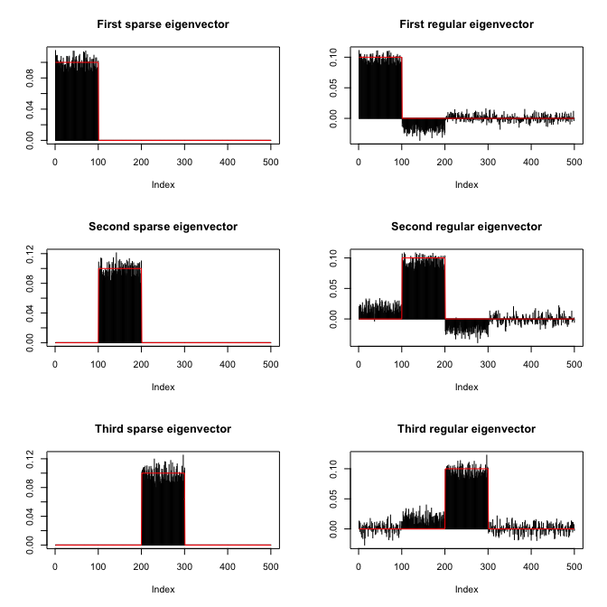

This vignette illustrates the computation of sparse eigenvectors or
sparse PCA with the package `sparseEigen` (with a comparison with other
packages) and gives a description of the algorithms used.

Comparison with other packages
==============================

hulsdhiuvhsdal

Usage of the package
====================

Computation of sparse eigenvectors of a given matrix
----------------------------------------------------

We start by loading the package and generating synthetic data with
sparse eigenvectors:

    library(sparseEigen)
    set.seed(42)

    # parameters 
    m <- 500  # dimension
    n <- 100  # number of samples
    q <- 3  # number of sparse eigenvectors to be estimated
    sp_card <- 0.2*m  # cardinality of each sparse eigenvector
    rho <- 0.6  # sparsity level

    # generate non-overlapping sparse eigenvectors
    V <- matrix(rnorm(m^2), ncol = m)
    tmp <- matrix(0, m, q)
    for (i in 1:max(q, 2)) {
      ind1 <- (i - 1)*sp_card + 1
      ind2 <- i*sp_card
      tmp[ind1:ind2, i] = 1/sqrt(sp_card)
      V[, i] <- tmp[, i]
    }
    V <- qr.Q(qr(V))  # keep first q eigenvectors the same (already orthogonal) and orthogonalize the rest

    # generate eigenvalues
    lmd <- rep(1, m)
    lmd[1:q] <- 100*seq(from = q, to = 1)

    # generate covariance matrix from sparse eigenvectors and eigenvalues
    R <- V %*% diag(lmd) %*% t(V)

    # generate data matrix from a zero-mean multivariate Gaussian distribution with the constructed covariance
    X <- MASS::mvrnorm(n, rep(0, m), R)  # random data with underlying sparse structure
    X <- scale(X, center = TRUE, scale = FALSE)  # center the data

Then we estimate the covariance matrix with `cov(X)` and compute its
sparse eigenvectors:

    # computation of sparse eigenvectors
    res_standard <- eigen(cov(X))
    res_sparse1 <- spEigen(cov(X), q, rho)
    res_sparse2 <- spEigen(X, q, rho, data = TRUE)

We can assess how good the estimated eigenvectors are by computing the
inner product with the original eigenvectors (the closer to 1 the
better):

    # show inner product between estimated eigenvectors and originals
    abs(diag(t(res_standard$vectors) %*% V[, 1:q]))   #for standard estimated eigenvectors
    #> [1] 0.9726306 0.9488030 0.9623054
    abs(diag(t(res_sparse1$vectors) %*% V[, 1:q]))    #for sparse estimated eigenvectors
    #> [1] 0.9975791 0.9968073 0.9956102
    abs(diag(t(res_sparse2$vectors) %*% V[, 1:q]))    #for sparse estimated eigenvectors
    #> [1] 0.9975774 0.9968051 0.9956073

Finally, the following plot shows the sparsity pattern of the
eigenvectors (sparse computation vs. classical computation):

    par(mfcol = c(3, 2))
    plot(res_sparse1$vectors[, 1]*sign(res_sparse1$vectors[1, 1]), 
         main = "First sparse eigenvector", xlab = "index", ylab = "", type = "h")
    lines(V[, 1]*sign(V[1, 1]), col = "red")
    plot(res_sparse1$vectors[, 2]*sign(res_sparse1$vectors[sp_card+1, 2]), 
         main = "Second sparse eigenvector", xlab = "index", ylab = "", type = "h")
    lines(V[, 2]*sign(V[sp_card+1, 2]), col = "red")
    plot(res_sparse1$vectors[, 3]*sign(res_sparse1$vectors[2*sp_card+1, 3]), 
         main = "Third sparse eigenvector", xlab = "index", ylab = "", type = "h")
    lines(V[, 3]*sign(V[2*sp_card+1, 3]), col = "red")

    plot(res_standard$vectors[, 1]*sign(res_standard$vectors[1, 1]), 
         main = "First regular eigenvector", xlab = "index", ylab = "", type = "h")
    lines(V[, 1]*sign(V[1, 1]), col = "red")
    plot(res_standard$vectors[, 2]*sign(res_standard$vectors[sp_card+1, 2]), 
         main = "Second regular eigenvector", xlab = "index", ylab = "", type = "h")
    lines(V[, 2]*sign(V[sp_card+1, 2]), col = "red")
    plot(res_standard$vectors[, 3]*sign(res_standard$vectors[2*sp_card+1, 3]), 
         main = "Third regular eigenvector", xlab = "index", ylab = "", type = "h")
    lines(V[, 3]*sign(V[2*sp_card+1, 3]), col = "red")

Covariance matrix estimation with sparse eigenvectors
-----------------------------------------------------

lalala

Explanation of the algorithms
=============================

`spEigen()`: Sparse eigenvectors from a given covariance matrix
---------------------------------------------------------------

The goal of `spEigen()` is the estimation of the *q* leading sparse
eigenvectors (with *q* ≤ rank(**S**)) from an *m* × *m* covariance
matrix **S** (typically the sample covariance matrix obtained from *n*
samples) based on \[1\]. The underlying optimization problem that is
solved is
$$\\begin{equation}
    \\begin{aligned}
      &\\underset{\\mathbf{U}}{\\text{maximize}}\\quad \\text{Tr} \\left(\\mathbf{U}^\\top \\mathbf{S} \\mathbf{U} \\text{Diag}   (\\mathbf{d})\\right) - \\sum\_{i=1}^{q}\\rho\_i\\|\\mathbf{u}\_i\\|\_0\\\\
    &\\text{subject to}\\quad \\mathbf{U}^\\top\\mathbf{U}=\\mathbf{I}\_q,
  \\end{aligned}
    \\end{equation}$$
 where **U** ∈ ℝ*m* × *q* is a matrix containing the *q*
leading eigenvectors, **d** is a vector of weights to ensure that **U**
contains the leading eigenvectors without an arbitrary rotation, and the
*ρ**i*'s are the regularization parameters to control how
much sparsity is desired. This problem is the typical PCA formulation
with an extra penalty term in the objective that penalizes the
cardinality of the eigenvectors, controled by the regularization
parameters *ρ**i*'s.

The ℓ0-"norm" is approximated by the continuous and
differentiable function
$$\\begin{equation}
        g\_p^{\\epsilon}\\left(x \\right)= \\begin{cases}
        \\frac{x^2}{2\\epsilon(p+\\epsilon)\\log(1+1/p)},& |x|\\leq\\epsilon,\\\\
        \\frac{\\log\\left(\\frac{p+|x|}{p+\\epsilon}\\right)+\\frac{\\epsilon}{2(p+\\epsilon)}}{\\log(1+1/p)},& |x|&gt;\\epsilon,
        \\end{cases}
        \\end{equation}$$
 where *p* &gt; 0 and 0 &lt; *ϵ* ≪ 1 are parameters that control the
approximation. This leads to the following approximate problem:
$$\\begin{equation}
    \\begin{aligned}
      &\\underset{\\mathbf{U}}{\\text{maximize}}\\quad \\text{Tr} \\left(\\mathbf{U}^\\top \\mathbf{S} \\mathbf{U} \\text{Diag}   (\\mathbf{d})\\right) - \\sum\_{j=1}^{q}\\rho\_j\\sum\_{i=1}^{m}g\_p^{\\epsilon}\\left(u\_{ij}\\right)\\\\
    &\\text{subject to}\\quad \\mathbf{U}^\\top\\mathbf{U}=\\mathbf{I}\_q.
  \\end{aligned}
    \\end{equation}$$

This problem can be solved via Majorization-Minimization (MM) \[2\] with
an iterative closed-form update algorithm. For this, at each iteration
(denoted by *k*) two key quantities are needed:

**G**(*k*) = **S****U**(*k*)Diag(**d**)
  
$$\\mathbf{H}^{(k)}=\\left\[\\text{diag}\\left(\\mathbf{w}^{(k)}-\\mathbf{w}\_{\\max}^{(k)}\\otimes\\mathbf{1}\_{m}\\right)\\mathbf{\\tilde{u}}^{(k)}\\right\]\_{m\\times q},$$
 where
$$w\_{i}^{(k)}= \\begin{cases}
        \\frac{\\rho\_i}{2\\epsilon(p+\\epsilon)\\log(1+1/p)},& |\\tilde{u}^{(k)}\_{i}|\\leq\\epsilon,\\\\
        \\frac{\\rho\_i}{2\\log(1+1/p)|\\tilde{u}^{(k)}\_{i}|\\left(|\\tilde{u}^{(k)}\_{i}|+p\\right)},&                |\\tilde{u}^{(k)}\_{i}|&gt;\\epsilon,
        \\end{cases}$$
 with **w** ∈ ℝ+*m**q*,
$\\mathbf{\\tilde{u}}^{(k)} = \\text{vec}(\\mathbf{U}^{(k)})\\in\\mathbb{R}\_+^{mq}$,
**w**max ∈ ℝ+*q*, with
*w*max, *i* being the maximum weight that corresponds to the
*i*-th eigenvector **u***i*(*k*).

The iterative closed-form update algorithm is:

> 1.  Set *k* = 0 and choose an initial point **U**(0)  
> 2.  Compute **G**(*k*) and **H**(*k*)  
> 3.  Compute **V**L, **V**R as the left and right
>     singular vectors of
>     (**G**(*k*)−**H**(*k*))  
> 4.  **U**(*k* + 1) ← **V**L**V**R⊤  
> 5.  *k* ← *k* + 1  
> 6.  Repeat steps 2-5 until convergence  
> 7.  Return **U**(*k*)

The initial point of the algorithm **U**(0) is set by default
to the *q* leading standard eigenvectors, unless the user specifies
otherwise. Internally, all the computations of **G**(*k*) and
**H**(*k*) are done through the eigenvalue decomposition
(EVD) of **S**. Since we can also retrieve the eigenvectors and
eigenvalues of **S** through the singular value decomposition (SVD) of
the data matrix **X**, with
$\\mathbf{S} = \\frac{1}{n-1}\\mathbf{X}^\\top\\mathbf{X}$, it becomes
possible to use as an input to 'spEigen()' either the covariance matrix
**S** or directly the data matrix **X**.

Although **H**(*k*) does not depend directly on **S**, the
parameters *ρ**j* are set based on its eigenvalues. In
particular, each *ρ**j* takes a value in an interval
\[0, *ρ**j*max\] based on the input variable
*ρ* ∈ \[0, 1\] that the user selects, i.e.,
*ρ**j* = *ρ**ρ**j*max. The uppperbound
*ρ**j*max depends, among others, on the
eigenvalues of **S**. Note that the theoretical upperbound is derived
based on the initial problem and not the approximate. Therefore,
although a suggested range for *ρ* is the interval \[0, 1\], any
nonnegative value is accepted by the algorithm.

`spEigenCov()`: Covariance matrix estimation with sparse eigenvectors
---------------------------------------------------------------------

References
==========

\[1\] K. Benidis, Y. Feng, and D. P. Palomar, “Sparse portfolios for
high-dimensional financial index tracking,” *IEEE Transactions on Signal
Processing*, vol. 66, no. 1, pp. 155–170, jan. 2018.

\[2\] Y. Sun, P. Babu, and D. P. Palomar, “Majorization-minimization
algorithms in signal processing, communications, and machine learning,”
*IEEE Transactions on Signal Processing*, vol. 65, no. 3, pp. 794–816,
feb. 2011.
